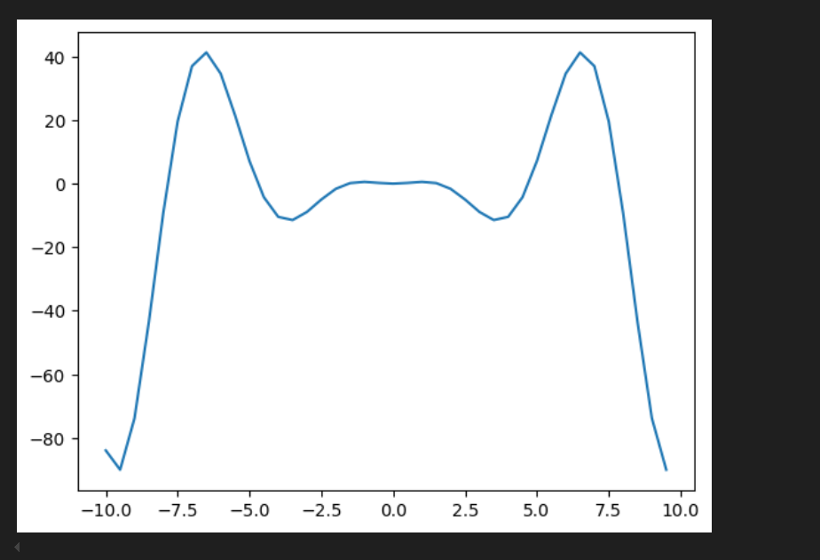

# Звіт до роботи 3
## Тема: Робота з числовими даними
### Мета роботи: Виконати всі завдання з двох робіт і попередніх лекційних/лабораторних занять.

---
## Виконання роботи
* ### Результати виконання завдань:
    1. Виконала код/приклади наведені в Notebook. Модифікувала Notebook, представлено [тут](./1.ipynb);
    1. Збережено лекції: [перша](./1_1.ipynb), [друга](./2_1.ipynb), [третя](./3_1.ipynb).
    

    Кілька скріншотів:

( ͡° ͜ʖ ͡°) 

---

## Висновок:

- Створено папку для третьої лабораторної роботи, у якій містяться файли з виконаними завданнями та папка скріншотів. 
- Отримано нові початкові(поверхневі) знання про числові методи в Python.
- Так, питань фактично не виникало. 
- Вдалося.
- Ні.
- Такий формат краще підходить для дистанційного (лекції).
- Наразі ідей та побажань для покращення немає.

---