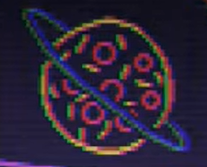
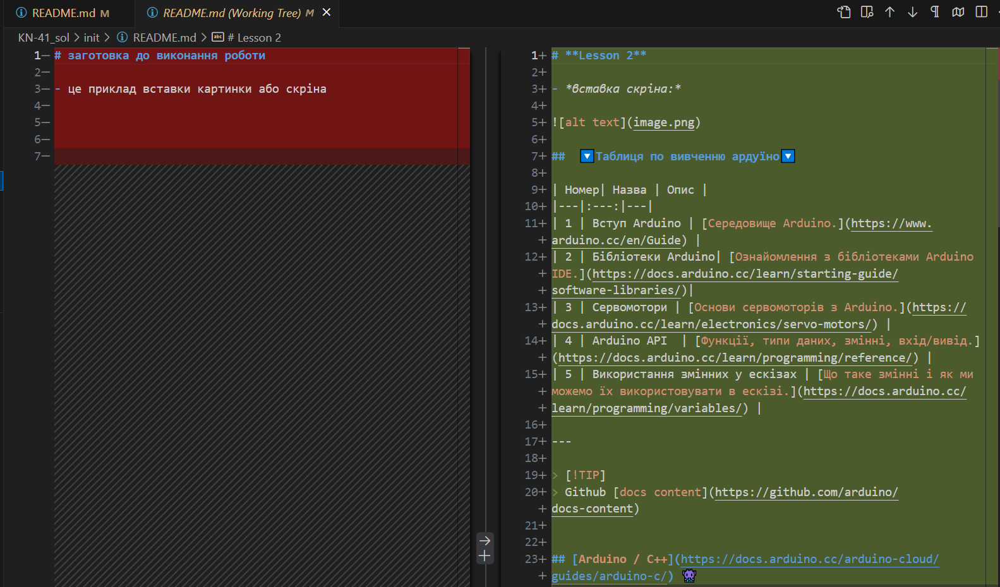

# **Lesson 2**

- *вставка скріна:*

## 	🔽Таблиця по вивченню ардуїно🔽

| Номер| Назва | Опис |
|---|:---:|---|
| 1 | Вступ Arduino | [Середовище Arduino.](https://www.arduino.cc/en/Guide) |
| 2 | Бібліотеки Arduino| [Ознайомлення з бібліотеками Arduino IDE.](https://docs.arduino.cc/learn/starting-guide/software-libraries/)|
| 3 | Сервомотори | [Основи сервомоторів з Arduino.](https://docs.arduino.cc/learn/electronics/servo-motors/) |
| 4 | Arduino API  | [Функції, типи даних, змінні, вхід/вивід.](https://docs.arduino.cc/learn/programming/reference/) |
| 5 | Використання змінних у ескізах | [Що таке змінні і як ми можемо їх використовувати в ескізі.](https://docs.arduino.cc/learn/programming/variables/) |

---

> [!TIP]
> Github [docs content](https://github.com/arduino/docs-content)

## [Arduino / C++](https://docs.arduino.cc/arduino-cloud/guides/arduino-c/) 👾

 - Типовим варіантом програмування вашої плати для підключення до Arduino Cloud є `використання мови C++` .

 - Конфігурація та з’єднання між вашою платою та Arduino Cloud підтримується бібліотекою ArduinoIoTCloud і бібліотеками Arduino_ConnectionHandler .

   >Під час програмування на C++ ви можете використовувати Arduino API (який також відомий як мова Arduino). Щоб дізнатися більше про Arduino API, перегляньте довідник мови .

## Вимоги 📁
  Для цього посібника вам потрібно буде мати зареєстрований обліковий запис на Arduino. Реєстрація за посиланням нижче:

+ `Створіть обліковий запис Arduino`.

### __*Вам також знадобиться підтримувана плата:*__
- [Офіційні плати Arduino Wi-Fi®](https://docs.arduino.cc/arduino-cloud/hardware/wifi/)
- [Плати ESP32 / ESP8266](https://docs.arduino.cc/arduino-cloud/hardware/wifi/#configure-esp-boards)
- [Офіційні дошки LoRaWAN®](https://docs.arduino.cc/arduino-cloud/hardware/lora/)
- [Офіційні налаштування Ethernet](https://docs.arduino.cc/arduino-cloud/hardware/ethernet/)
- [Офіційні стільникові плати (GSM/NB-IoT)](https://docs.arduino.cc/arduino-cloud/hardware/cellular/)

---
༼ つ ◕_◕ ༽つ: _🐠_ *🐟* 🦐 🦑 🐙 ~~🦞~~ ~~🦀~~ 🐋 🐳 🐬 ~~🦈~~ 🐍 🐡 ~~🐟~~  : (^◕.◕^)

