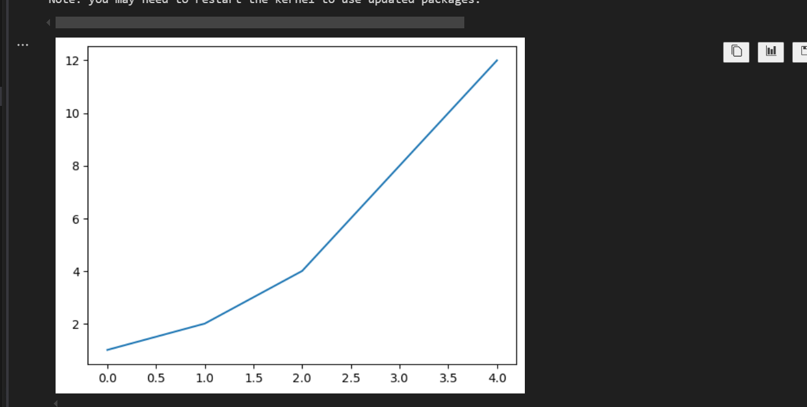
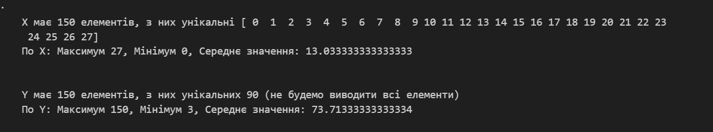
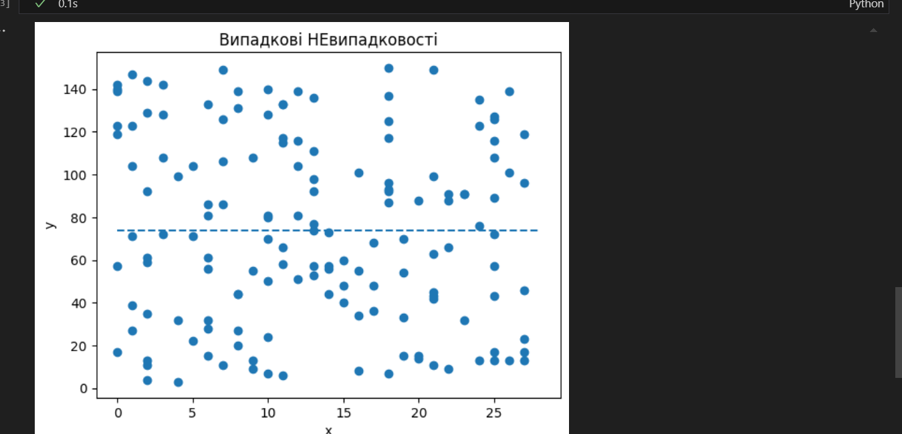
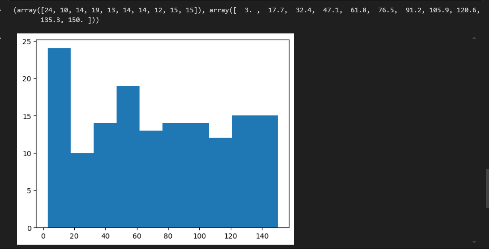
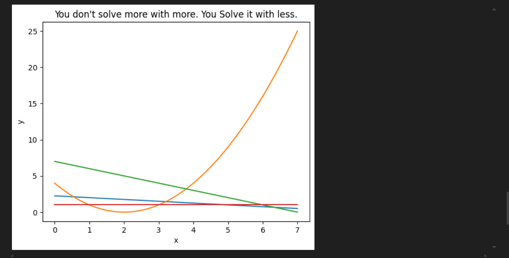

## Звіт до роботи
## Тема: Візуалізація результатів дослідження
### Мета роботи: Ознайомитися з основами візуалізації даних у Python за допомогою бібліотеки matplotlib. Навчитися створювати графіки у середовищі Jupyter Notebook, використовувати базові функції побудови лінійних графіків, гістограм.

---
## Виконання роботи

### **Скріншоти:**

-----------------------------------

### Висновок:

Ознайомилась із базовими можливостями бібліотеки matplotlib для візуалізації даних у середовищі Jupyter Notebook. Навчилась будувати різні типи графіків та налаштовувати їхні параметри для кращого візуального сприйняття. (прикольно насправді 👍👍👍)

---
