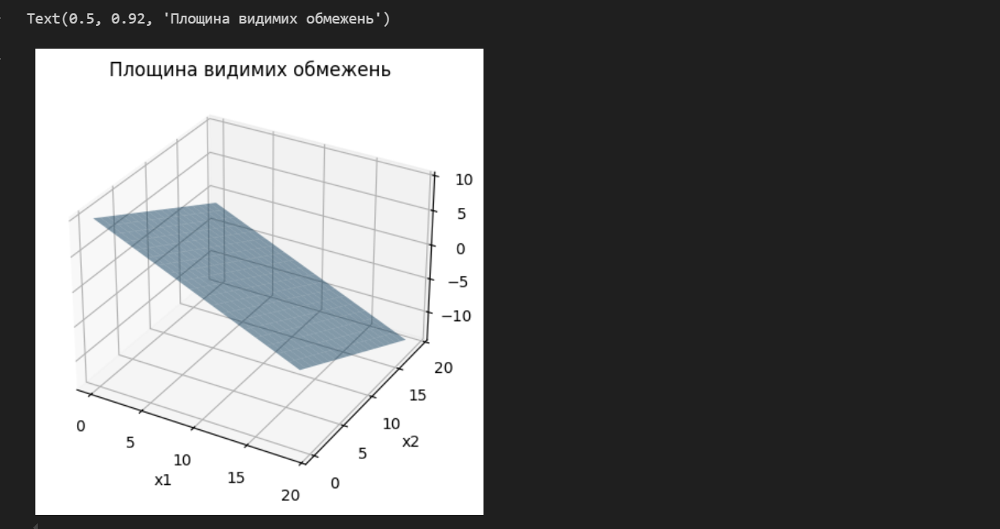
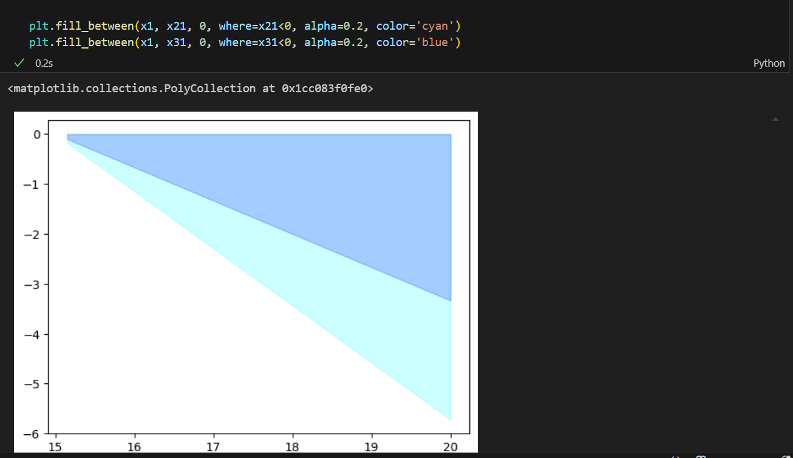
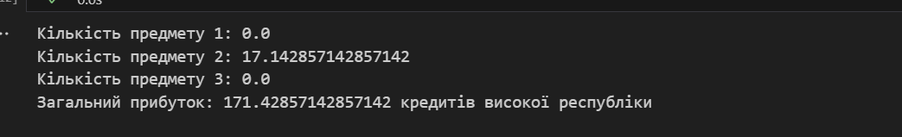

## Звіт до роботи
## Тема: Розвʼязання задач лінійного програмування
### Мета роботи: Ознайомитися з основами розв’язання задач лінійного програмування за допомогою Python. Вивчити застосування методу для розв’язання задач з обмеженнями.

---
## Виконання роботи

### **Скріншоти:**

-----------------------------------

### Висновок:

Ознайомилась із принципами лінійного програмування та методами його реалізації у Python. Навчилась використовувати метод для знаходження оптимальних рішень при заданих обмеженнях. 

(прикольно, але сказати не маю що більше, оскільки на швидкоруч робила)

---
