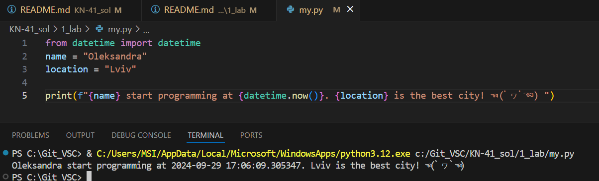
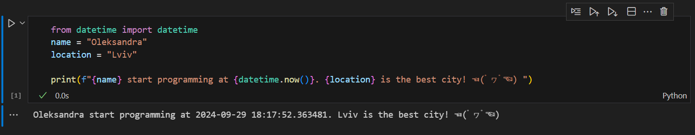

# Звіт до роботи 1
## Тема: оформлення робіт та перша програма
### Мета роботи: налаштувати середовище, створити репозиторій, попрацювати з Markdown та оформити звіт.

---
## Виконання роботи
* ### Результати виконання завдань:
    1. Створила репозиторій, [оформила його](https://github.com/osoldanchyn20/KN-41_sol).
    1. Навчилась працювати з репозиторієм та налаштувала інтеграцію з Visual Studio Code;
    1. Написала [першу програму Python та запустила її](./my.py). Програма вивела текст представлений на скріншоті:
    

    1. Написала [другу та третю програму Python та запустила її](./my_first_app.ipynb). Друга програма вивела текст представлений на скріншоті *(за третьою треба перейти за посиланням)*:
    

( ͡° ͜ʖ ͡°)  👻

---

## Висновок:

- Створено та оформлено репозиторій, але надалі буде вдосконалюватись. Ознайомлено з форматуванням Markdown. 
- Було досягнуто мету роботи: налаштувати середовище, створити репозиторій, попрацювати з Markdown та оформити звіт.
- Отримано нові знання: як працювати з Github, форматуванням Markdown та як створювати та зручно оформлювати репозиторій. 
- Наразі, додаткових питань не виникало, а бажання використовувати репозиторій у власних інтересах (відповідно створивши потім окремий).
- В принципі вдалося виконати завдання, хоча виконувала їх не суто по інструкції. ⏰
- В цій лабораторній труднощів не виникало, як і з налаштуванням середовища.
- О тааак, це набагато краще ніж звичайні звіти у Word документах. Та й з кодом працювати цікавіше, Github теж цікавий і зручний. **Мені найбільше подобається форматування Markdown, я в ньому набагато швидше оформлюю текст**, ніж в тому ж вордівському документі, де через одну дію все їде в далечінь. 🎭
- Були думки стосовно запису пар, так як приїхавши додому після 3-4 пар далеко не все залишається в голові з усного пояснення _(принаймні в мене так)_. Наразі та проблема вирішена _(частково повторювати чи робити шаблони прямо на парі + коменти/шпаргалки в нотатках)_.

---

⠀⠀⠀⠀⠀⠀⠀⠀⠀⠀⠀⠀⠀⠀⠀⠀⠀⠀⠀⠀⠀⠀⠀⢀⣀⡀⠀⠀⠀⢀⣀⠀⠀⠀⠀⠀⠀⠀⠀⠀⠀⠀⠀⠀⠀⠀
⠀⠀⠀⠀⠀⠀⠀⠀⠀⠀⠀⠀⣠⣤⣶⣾⣿⡉⢤⣍⡓⢶⣶⣦⣤⣉⠒⠤⡀⠀⠀⠀⠀⠀⠀⠀⠀⠀⠀⠀
⠀⠀⠀⠀⠀⠀⠀⠀⠀⢀⣴⣿⣿⣿⣿⣿⣿⣷⡀⠙⣿⣷⣌⠻⣿⣿⣿⣶⣌⢳⡀⠀⠀⠀⠀⠀⠀⠀⠀⠀
⠀⠀⠀⠀⠀⠀⠀⠀⣰⣿⣿⣿⣿⣿⣿⣿⣿⣿⣿⣄⠈⢿⣿⡆⠹⣿⣿⣿⣿⣷⣿⡀⠀⠀⠀⠀⠀⠀⠀⠀
⠀⠀⠀⠀⠀⠀⠀⣰⣿⣿⣿⣿⣿⣿⣿⣿⣿⣿⣿⣿⣷⣄⠹⣿⡄⢻⣿⣿⣿⣿⣿⣧⠀⠀⠀⠀⠀⠀⠀⠀
⠀⠀⠀⠀⠀⠀⢠⣿⣿⣿⣿⣿⣿⣿⣿⣿⣿⡿⠿⠿⣿⣿⣷⣽⣷⢸⣿⡿⣿⡿⠿⠿⣆⠀⠀⠀⠀⠀⠀⠀
⠀⠀⠀⠀⠀⠀⣼⣿⣿⣿⣿⣿⣿⣿⣿⣿⣿⡄⠀⠀⠀⠐⠾⢭⣭⡼⠟⠃⣤⡆⠘⢟⢺⣦⡀⠀⠀⠀⠀⠀
⠀⠀⠀⠀⠀⠀⣿⣿⣿⣿⣿⣿⣿⣿⣿⡿⢛⣥⣶⠾⠿⠛⠳⠶⢬⡁⠀⠀⠘⣃⠤⠤⠤⢍⠻⡄⠀⠀⠀⠀
⠀⠀⠀⠀⠀⠀⣿⣿⣿⣿⣿⣿⣿⡿⣫⣾⡿⢋⣥⣶⣿⠿⢿⣿⣿⣿⠩⠭⢽⣷⡾⢿⣿⣦⢱⡹⡀⠀⠀⠀
⠀⠀⠀⠀⠀⠀⣿⣿⣿⣿⣿⣿⡟⠈⠛⠏⠰⢿⣿⣿⣧⣤⣼⣿⣿⣿⡏⠩⠽⣿⣀⣼⣿⣿⢻⣷⢡⠀⠀⠀
⠀⠀⠀⠀⠀⢰⣿⣿⣿⣿⣿⣿⢁⣿⣷⣦⡀⠀⠉⠙⠛⠛⠛⠋⠁⠙⢻⡆⠀⢌⣉⠉⠉⠀⠸⣿⣇⠆⠀⠀
⠀⠀⠀⠀⢀⣾⣿⣿⣿⣿⣿⡇⢸⣿⣿⣿⣿⠷⣄⢠⣶⣾⣿⣿⣿⣿⣿⠁⠀⠀⢿⣿⣿⣿⣷⠈⣿⠸⡀⠀
⠀⠀⠀⠀⣼⣿⣿⣿⣿⣿⣿⠀⣌⡛⠿⣿⣿⠀⠈⢧⢿⣿⡿⠟⠋⠉⣠⣤⣤⣤⣄⠙⢿⣿⠏⣰⣿⡇⢇⠀
⠀⠀⠀⣼⣿⣿⣿⣿⣿⣿⡇⢸⣿⣿⣶⣤⣙⠣⢀⠈⠘⠏⠀⠀⢀⣴⢹⡏⢻⡏⣿⣷⣄⠉⢸⣿⣿⣷⠸⡄
⠀⠀⣸⣿⣿⣿⣿⣿⣿⣿⠁⣾⣟⣛⠛⠛⠻⠿⠶⠬⠔⠀⣠⡶⠋⠿⠈⠷⠸⠇⠻⠏⠻⠆⣀⢿⣿⣿⡄⢇
⠀⢰⣿⣿⣿⣿⠿⠿⠛⠋⣰⣿⣿⣿⣿⠿⠿⠿⠒⠒⠂⠀⢨⡤⢶⣶⣶⣶⣶⣶⣶⣶⣶⠆⠃⣀⣿⣿⡇⣸
⢀⣿⣿⠿⠋⣡⣤⣶⣾⣿⣿⣿⡟⠁⠀⣠⣤⣴⣶⣶⣾⣿⣿⣷⡈⢿⣿⣿⣿⣿⠿⠛⣡⣴⣿⣿⣿⣿⠟⠁
⣼⠋⢁⣴⣿⣿⣿⣿⣿⣿⣿⣿⠀⠀⠀⣿⣿⣿⣿⣿⣿⣿⣿⣿⣿⣎⠻⠟⠋⣠⣴⣿⣿⣿⣿⠿⠋⠁⠀⠀
⢿⣷⣿⣿⣿⣿⣿⣿⣿⣿⣿⣿⠀⣴⠀⠻⣿⣿⣿⣿⣿⣿⣿⣿⣿⣿⣧⣠⣾⣿⠿⠿⠟⠋⠁⠀⠀⠀⠀⠀
⠀⠉⠛⠛⠿⠿⠿⢿⣿⣿⣿⣵⣾⣿⣧⣾⣿⣿⣿⣿⣿⣿⣿⣿⣿⣿⣿⡿⠏⠀⠀⠀⠀⠀⠀⠀⠀⠀⠀⠀
⠀⠀⠀⠀⠀⠀⠀⠀⠀⠀⠀⠀⠀⠀⠀⠀⠀⠀⠉⠉⠉⠉⠉⠉⠉⠁⠀⠀⠀⠀⠀⠀⠀⠀⠀⠀⠀⠀⠀⠀⠀⠀⠀