## Звіт до роботи
## Тема: Робота у віртуальних середовищах
### Мета роботи: Ознайомити з принципами ізольованих віртуальних середовищ у Python, розглянути використання `pipenv`, `venv`, `poetry ` для створення, активації та керування середовищами.

---
### Виконання роботи
Наступні команди виконала у **терміналі** (Terminal -> New Terminal (Bash terminal)):

```bash
👍  pwd      
➕  cd KN-41_sol/   
👍  cd testing/1_lab  
👍  python -V 
👍  pip -V 
👍  python -m ensurepip --upgrade 
👍  pip list # виведе всі глобальні пакети
👍  python -m venv sandra_env # створилась окрема папка
🟥  source sandra_env/bin/activate   # навіть через git bush не пішло
🟩  source sandra_env/Scripts/activate
🟨  pip install requests  #виникли труднощі з папками (попри активацію ВС, інсталювало глобально)
➕  python -m pip install --upgrade pip
🟥  python 1.py
🟩  python /c/Git_VSC/KN-41_sol/testing/1.py
👍  pip freeze > requirements.txt
👍  pip list
👍  deactivate
🟨  pip install pipenv
👍  pipenv -h
👍  cd KN-41_sol/testing/1_lab
👍  pipenv install requests
👍  pipenv shell
👍  python 1.py
🟥  deactivate
🟩  exit
```
### **Скріншоти:**

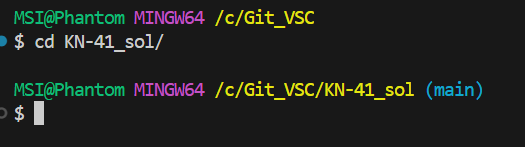
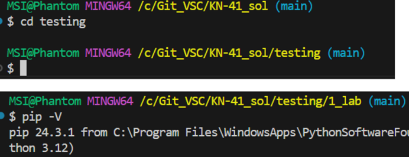
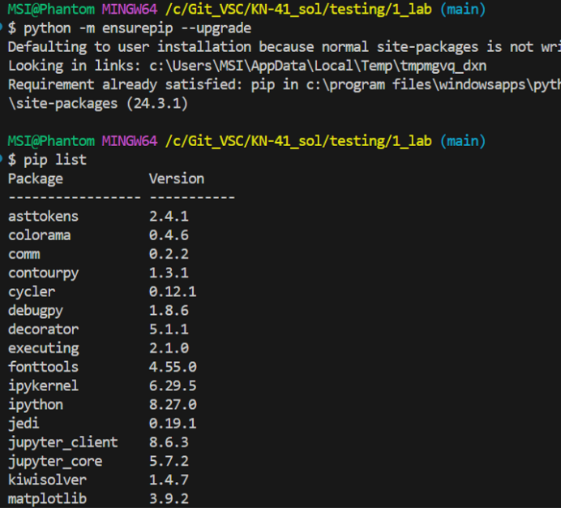
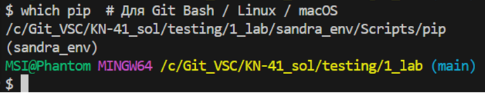
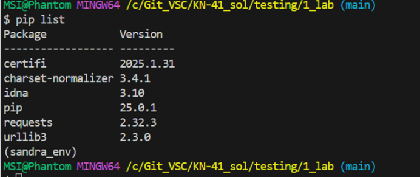
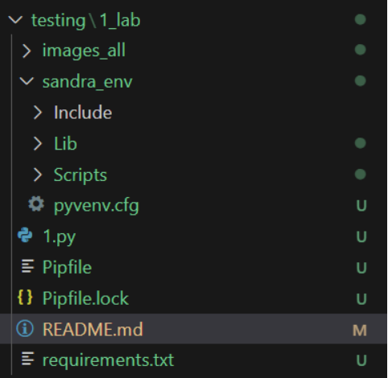
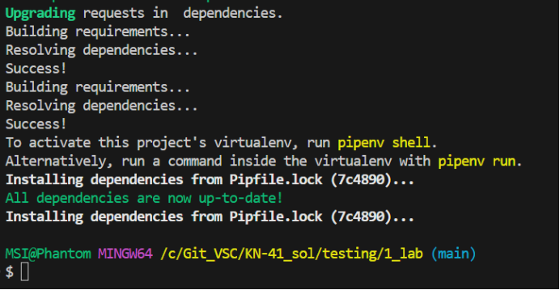
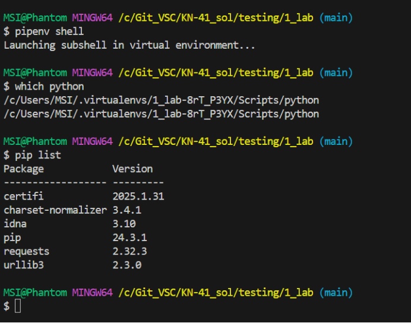
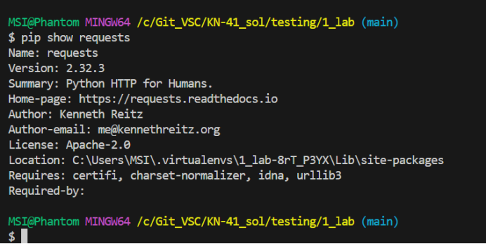
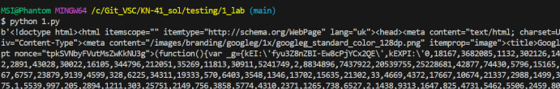
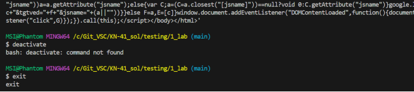
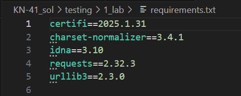

-----------------------------------


### Висновок:

Ознайомилась з віртуальними ізольованими середовищами Python, спробувала їх використати, ввела основні та додаткові команди (оскільки на Windows), щоб на практиці це освоїти. Отримала нові знання з використання віртуальних середовищ для використання у проектах.
В загальному матеріал зрозумілий (десь 85-95%), але на практиці є складнішим.
Ця робота складніша за попередні, часто виникали помилки та проблеми під час виконання лабораторної (особливо при знаходженні шляху Пайтона у віндовс та "pipenv install requests"). 
Мабуть, варто б було спробувати відео лекцію\зразок для складних лабораторних.

---
