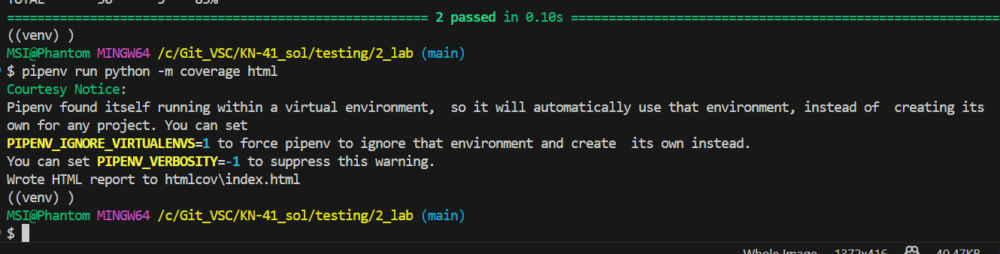
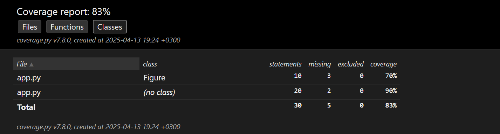

## Звіт до роботи
## Тема: Написання тестів на Python
### Мета роботи: Ознайомитися з основами тестування в Python. Вивчити принципи використання `assert`, модулів `unittest` і `pytest`, створення юніт-тестів, а також застосування покриття коду за допомогою `coverage` і `pytest-cov`.

---
### Виконання роботи
Наступні команди виконала у **терміналі** (Terminal -> New Terminal (Bash terminal)):

```bash
cd KN-41_sol/testing/2_lab
python -m venv venv
source venv/scripts/activate  # появилось ((venv))
pip install pytest
python --version
which python
python assert_test.py
python assert_input.py
python assert_class.py
python assert_raise.py
python test_app.py
pytest app.py -v
pipenv install coverage pytest-cov --dev
pipenv run pytest --cov=app app.py --cov-report=term
pipenv run python -m coverage html # Wrote HTML report to htmlcov\index.html
```

### **Скріншоти:**








-----------------------------------


### Висновок:

Ознайомилась з основами тестування у Python, включаючи використання `assert`, створення юніт-тестів через `unittest` та `pytest`, а також перевірку покриття коду за допомогою `coverage`. Практично реалізувала тестування класу, запуск тестів і перегляд звітів у терміналі та браузері. Матеріал зрозумілий в теорії, але реалізація без уважності та терпіння може йти тяжко. Під час виконання виникали труднощі, але вдалося їх вирішити. Робота вийшла складнішою за першу (на початку), але далі було легше ніж у першій.
---
