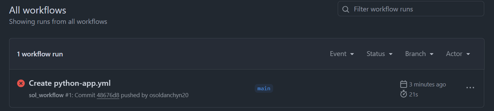
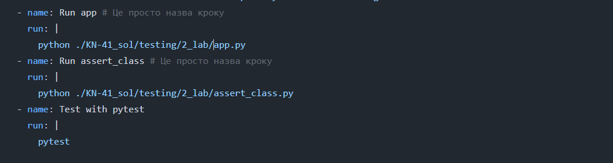
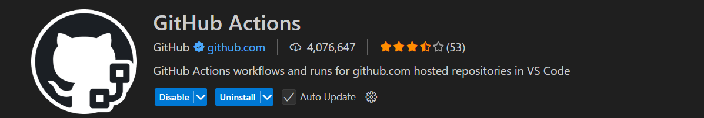
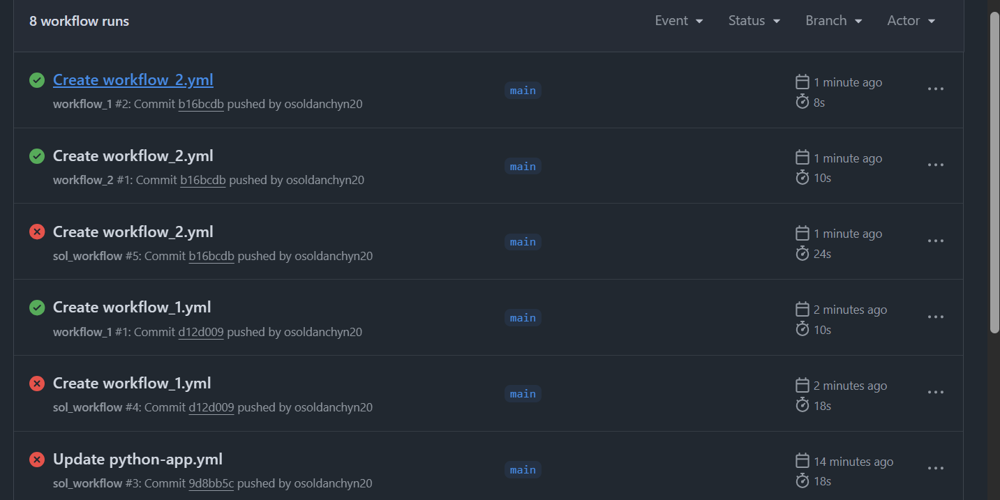
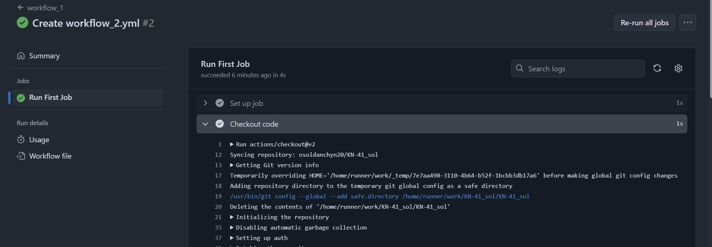
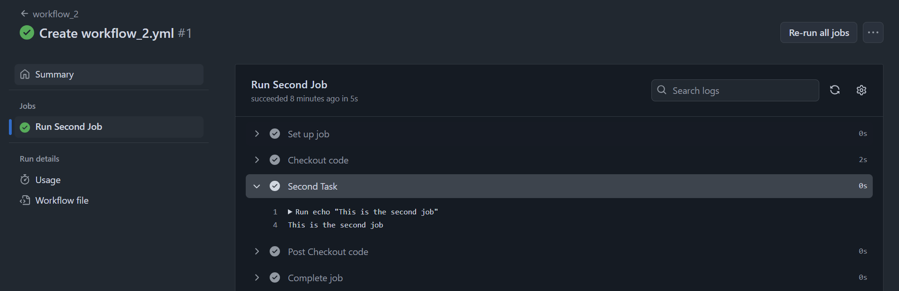
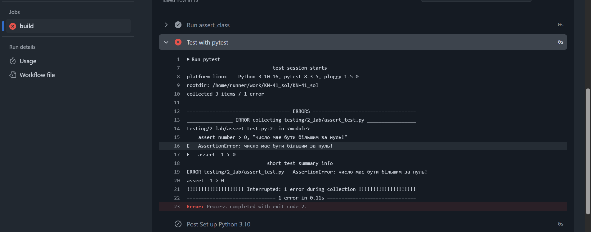

## Звіт до роботи
## Тема: Автоматизація процесу тестування

---

### **Скріншоти:**

-----------------------------------

### Висновок:

Далеко не все вийшло налаштувати, + є тести які падають за замовчуванням (вони і мають падати за умовою, тому поки їх виправляти не буду), не вдалось добре підключити інтеграцію з codecov.io, бо робилось на швидкоруч. Може якось виправлю (суто для себе колись). Але погратись з воркфловами було цікаво і тригерно.

