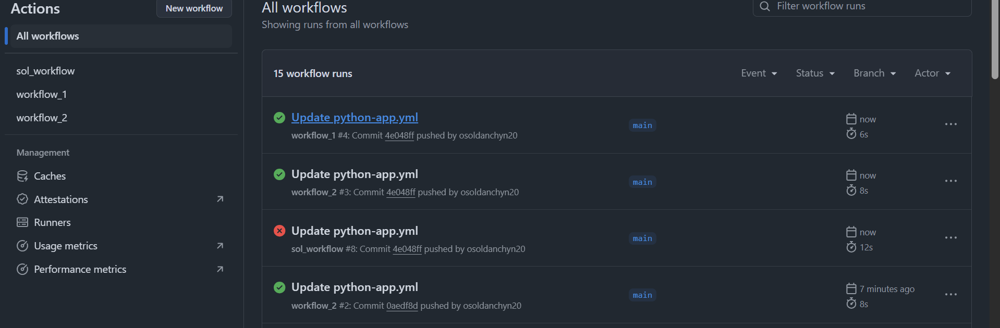

[](https://github.com/osoldanchyn20/KN-41_sol/actions/workflows/python-app.yml)

[](https://github.com/osoldanchyn20/KN-41_sol/actions/workflows/workflow_1.yml)

[](https://github.com/osoldanchyn20/KN-41_sol/actions/workflows/workflow_2.yml)

## Звіт до роботи
## Тема: Автоматизація процесу тестування
### Мета роботи: Ознайомитися з основами тестування в Python. Вивчити принципи використання `assert`, модулів `unittest` і `pytest`, створення юніт-тестів, а також застосування покриття коду за допомогою `coverage` і `pytest-cov`.

---
### Виконання роботи


---
Наступні команди виконала у **терміналі** (Terminal -> New Terminal (Bash terminal)):

```bash
cd KN-41_sol/testing/2_lab


```

### **Скріншоти:**





-----------------------------------


### Висновок:

Ознайомилась з основами тестування у Python, включаючи використання `assert`, створення юніт-тестів через `unittest` та `pytest`, а також перевірку покриття коду за допомогою `coverage`. Практично реалізувала тестування класу, запуск тестів і перегляд звітів у терміналі та браузері. Матеріал зрозумілий в теорії, але реалізація без уважності та терпіння може йти тяжко. Під час виконання виникали труднощі, але вдалося їх вирішити. Робота вийшла складнішою за першу (на початку), але далі було легше ніж у першій.

